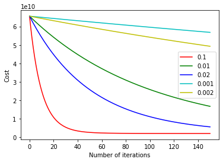

## Implementation of neural network, logistic and linear regressions in Python.

The repository presents "from scratch" implementation of the above algorithms, based on Andrew Ng's courses.


### External modules involved:

`numpy`, `matplotlib`, `scipy`


### Basic usage examples:
  * #### Linear Regression
  
   *Let's assume we've got the following input data `x` and output/target data `y`.*
  
  ```python
  x = np.array([[121, 7],
                [453, 12],
                [111, 5],
                [228, 10],
                [311, 9]])

  y = np.array([[29], [110], [20], [70], [83]])
  
  ```
     
   *First, we shall create an instance of the `LinReg` class. If we want to normalize features, that's the exact moment. After the below code is run, initial thetas will be set to 0s. Also, `mean` and `std` values used for normalization will be kept as the instance attributes. It's worth noting that `add_bias` parameter is responsible for handling the intercept term. It's set to `True` by default.*
  
  ```python
  linreg = LinReg(x, y, normalize=True)
    
  ```
  
  *That's all we need to start fitting a model. There are 3 public methods available for reaching the goal:*  
   1. *`normal_equation`:* 
   
   ```python
   theta = linreg.normal_equation()
    
   ```
   2. *`gradient_descent`:*
   
   ```python
   theta, cost = linreg.gradient_descent(alpha=0.9, iterations=100, cost_fnt='mse', Lambda=0)
   
   ```
   3. *`optimizer` with scipy minimize under the hood:*
   
   ```python
   theta, cost = linreg.optimizer('mse', 20, 0, method='L-BFGS-B')
   
   ```
   
  *Finally, we can use `predict` on training or test data to examine model performance.*
   
   ```python
    forecast = linreg.predict(linreg.data, theta)
   
    new_example = np.array([[1, 311, 9]])
    forecast = linreg.predict(new_example, theta)
   
   ```
  
  * #### Logistic Regression
  
  *Let's declare some training set and classes vector.*
  
  ```python
  X = np.array([[0.51, 0.26, 0.71],
                  [0.3, 0.14, 0.18],
                  [0.2, 0.99, 0.18],
                  [0.11, 0.22, 0.44],
                  [0.48, 0.77, 0.61]])

  Y = np.array([[0], [0], [0], [1], [1]])
  
  ```
  
  *Now, let's instantiate a classifier.*
  
  ```python
  logreg = LogReg(X, Y, normalize=False)
  
  ```
  
  *Finally, we can train a classifier. We may do this using **gradient descent**...*
  
  ```python
  weights, cost = logreg.gradient_descent(alpha=0.001, iterations=10, cost_fnt='sigmoid', 
                                          Lambda=1, cost_history=False)
  
  ```
  
  *...or by taking advantage of **scipy optimizer**.*
  
  ```python
  weights, cost = logreg.optimizer('sigmoid', iterations=30, Lambda=0, method='TNC')
  
  ```
  
  *When the training is done, we can check how good it converged by examining some classic metrics.*
  
  ```python
  f1_score, accuracy = logreg.get_metrics(weights, weighted=False)
  
  ```
  
  
  * #### Neural Network
  *We use the same illustrative `X` and `Y` data and let the network initialize random weights itself.
  The following example will create fully connected neural network with 3 hidden layers.*
  
  ```python
  net = Net(X, [30, 20, 5], Y)
  
  ```
  
  *Training is handled by scipy optimizer. Minimizing method can be defined as shown. `L-BFGS-B` or `TNC` approach is recommended.*
  
  ```python
  net.train(iterations=30, Lambda=0, method='L-BFGS-B')
  
  ```
  
  *As before, we can check how well the model fits our training data by running `get_metrics` method.*
  
  ```python
  f1_score, accuracy = net.get_metrics(weighted=True, details=True)
  
  ```
  
  *If we however would like to pass some weights as well, they have to be organized in a dictionary where keys indicate specific layers the weights "belong to". E.g. key 0 refers to L0; key 1 refers to L1, etc.*
  
  ```python
  theta0 = np.array([[0.18, 0.44, 0.29, 0.11],
                     [0.33, 0.22, 0.77, 0.88],
                     [0.64, 0.52, 0.11, 0.34]])

  theta1 = np.array([[0.22, 0.14, 0.11, 0.8],
                     [0.55, 0.33, 0.11, 0.3]])

  theta = {0: theta0, 1: theta1}
  
  ```
  
  *Instantiating is similar to the previous example. We only have to pass the `theta` dictionary this time.*
  
  ```python
  net = Net(X, [3], Y, theta=theta)
  ```

### Appendix

  * Logistic and linear regressions provide an interface for adding other cost algorithms relatively easy. The reference to new implementations should be placed in the `costs` dictionary, according to the existing pattern.

  * If you'd like to engage the module in your own projects, it's recommended to use optimized methods, because pure gradient descent can be slow. On the other hand, it may appear useful when education is the goal.

  * The `alpha_selection_helper` method can be helpful if you want to find a satisfying learning rate for gradient descent approach.



  * Please, feel free to contact me if you find a bug, typo or have some questions.

### Contact

#### abcs.luk@gmail.com

### License
[MIT](https://choosealicense.com/licenses/mit/)
